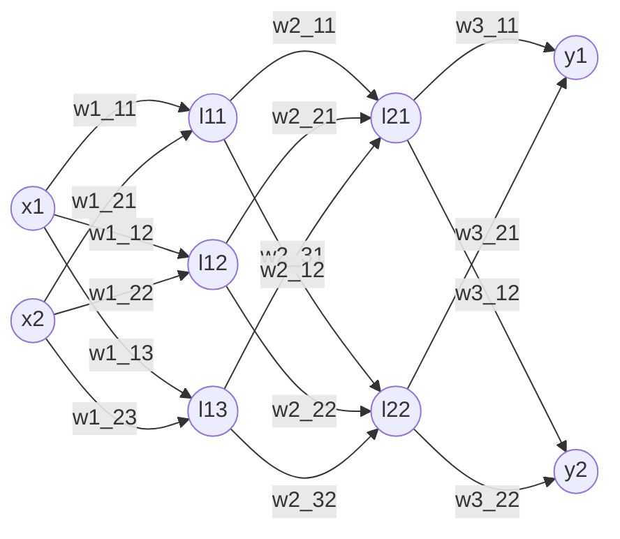

# 간단한 3층 신경망 구현 코드

가중치와 편항이 하드 코딩된 3층 신경망

<!--more-->



# python 코드
```python
import numpy as np
from sigmoid import sigmoid

def init_network(): ## 가충치, 편향 값을 세팅한다.
    network = {}
    network['W1'] = np.array([[0.1, 0.3, 0.5], [0.2, 0.4, 0.6]])
    network['b1'] = np.array([0.1, 0.2, 0.3])

    network['W2'] = np.array([[0.1, 0.4], [0.2, 0.5], [0.3, 0.6]])
    network['b2'] = np.array([0.1, 0.2])

    network['W3'] = np.array([[0.1, 0.3], [0.2, 0.4]])
    network['b3'] = np.array([0.1, 0.2])

    return network

def forward(network, x):
    W1, W2, W3 = network['W1'], network['W2'], network['W3']
    b1, b2, b3 = network['b1'], network['b2'], network['b3']

    x1 = np.dot(x, W1) + b1
    z1 = sigmoid(x1)
    x2 = np.dot(z1, W2) + b2
    z2 = sigmoid(x2)
    a3 = np.dot(z2, W3) + b3
    y = a3 # 출력층 활성함수는 다르다. 여기서는 제외.

    return y

network = init_network()
x = np.array([1.0, 0.5])
y = forward(network, x)

print(y)


```

## 출력
`[0.31682708 0.69627909]`


reference : 밑바닥부터 배우는 딥러닝